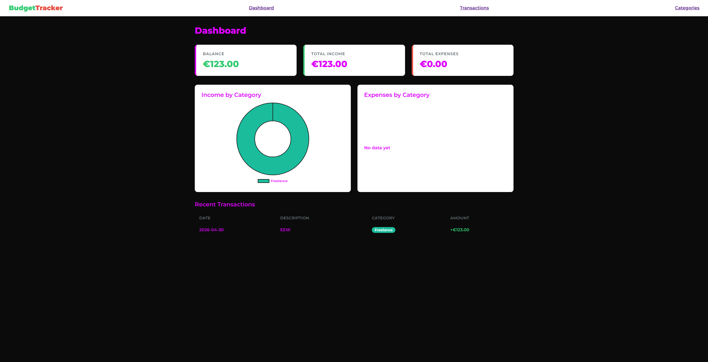

# BudgetTracker 💰
 
A full-stack budget tracking web application for managing personal finances. Track your income, expenses, and spending habits through an intuitive dashboard with visual charts.
 
## 🔗 Live Demo
**[https://budgettracker-woxx.onrender.com](https://budgettracker-woxx.onrender.com)**
 
---
 
## 📸 Preview
 

 
---
 
## ✨ Features
 
- **Dashboard** — Real-time overview of balance, total income, and total expenses
- **Visual Charts** — Donut charts showing income and expenses broken down by category
- **Transactions** — Full list of transactions with filtering support and ability to create new ones
- **Categories** — Manage custom categories (income or expense type) with color coding
- **REST API** — Clean backend API with structured endpoints for all data operations
- **Auto-seeded Database** — Default categories created automatically on first run
---
 
## 🛠️ Tech Stack
 
**Frontend**
- HTML, CSS, JavaScript (Vanilla)
- Chart.js for data visualization

**Backend**
- Node.js
- Express.js
- SQLite (via better-sqlite3)

**Architecture**
- RESTful API design
- Raw SQL queries (no ORM)
- Separation of frontend and backend
---
 
## 🚀 Running Locally
 
**1. Clone the repository**
```bash
git clone https://github.com/debil-ultra/BudgetTracker.git
cd BudgetTracker
```
 
**2. Install dependencies**
```bash
cd backend
npm install
```
 
**3. Start the server**
```bash
node app.js
```
 
**4. Open in browser**
```
http://localhost:3000
```
 
---
 
## 📡 API Endpoints

Base URL (local): `http://localhost:3000`

All request/response bodies are JSON. Error responses use `{ "error": "message" }`.

---

### Categories

#### `GET /categories`

Returns all categories, optionally filtered by type.

**Query params**

| Param | Type | Required | Description |
|-------|------|----------|-------------|
| `type` | string | No | Filter by `income` or `expense` |

**Status codes**

| Code | Explanation |
|------|-------------|
| `200` | Success — returns an array of category objects |
| `400` | Invalid `type` value (must be `income` or `expense`) |

**Response `200`**

```json
[
  { "id": 1, "name": "Salary", "type": "income", "color": "#2ecc71" }
]
```

---

#### `GET /categories/:id`

Returns a single category by ID.

**Path params**

| Param | Type | Required | Description |
|-------|------|----------|-------------|
| `id` | integer | Yes | Category ID |

**Status codes**

| Code | Explanation |
|------|-------------|
| `200` | Success — returns the category object |
| `404` | No category with that ID |

---

#### `POST /categories`

Creates a new category.

**Request body**

| Field | Type | Required | Description |
|-------|------|----------|-------------|
| `name` | string | Yes | Category name (must be unique) |
| `type` | string | Yes | `income` or `expense` |
| `color` | string | No | Hex color (e.g. `#2ecc71`). Defaults to green for income, red for expense |

**Status codes**

| Code | Explanation |
|------|-------------|
| `201` | Created — returns the new category with its `id` |
| `400` | Missing `name`/`type`, or invalid `type` |

**Response `201`**

```json
{ "id": 6, "name": "Groceries", "type": "expense", "color": "#e74c3c" }
```

---

#### `PUT /categories/:id`

Updates an existing category.

**Path params**

| Param | Type | Required | Description |
|-------|------|----------|-------------|
| `id` | integer | Yes | Category ID |

**Request body**

| Field | Type | Required | Description |
|-------|------|----------|-------------|
| `name` | string | Yes | Updated name |
| `type` | string | Yes | `income` or `expense` |
| `color` | string | No | Updated color. Keeps the existing color if omitted |

**Status codes**

| Code | Explanation |
|------|-------------|
| `200` | Success — returns the updated category |
| `400` | Missing `name`/`type`, or invalid `type` |
| `404` | Category not found |

---

#### `DELETE /categories/:id`

Deletes a category. Fails if transactions still reference it.

**Path params**

| Param | Type | Required | Description |
|-------|------|----------|-------------|
| `id` | integer | Yes | Category ID |

**Status codes**

| Code | Explanation |
|------|-------------|
| `200` | Deleted — `{ "message": "Category deleted successfully" }` |
| `404` | Category not found |
| `409` | Category still has linked transactions (foreign key constraint) |

---

### Transactions

List and detail responses include joined category fields: `category_name`, `category_type`, `color`.

#### `GET /transactions`

Returns all transactions with category details. Filters can be combined (AND logic).

**Query params**

| Param | Type | Required | Description |
|-------|------|----------|-------------|
| `category_id` | integer | No | Filter by category |
| `type` | string | No | Filter by category type (`income` or `expense`) |
| `date` | string | No | Exact date match (`YYYY-MM-DD`) |

**Status codes**

| Code | Explanation |
|------|-------------|
| `200` | Success — returns an array of transaction objects |

**Response `200`**

```json
[
  {
    "id": 1,
    "amount": 50.00,
    "description": "Lunch",
    "date": "2026-06-05",
    "category_id": 3,
    "category_name": "Food",
    "category_type": "expense",
    "color": "#e74c3c"
  }
]
```

---

#### `GET /transactions/:id`

Returns a single transaction with category details.

**Path params**

| Param | Type | Required | Description |
|-------|------|----------|-------------|
| `id` | integer | Yes | Transaction ID |

**Status codes**

| Code | Explanation |
|------|-------------|
| `200` | Success — returns the transaction object |
| `404` | Transaction not found |

---

#### `POST /transactions`

Creates a new transaction.

**Request body**

| Field | Type | Required | Description |
|-------|------|----------|-------------|
| `amount` | number | Yes | Positive number |
| `date` | string | Yes | Transaction date (`YYYY-MM-DD`) |
| `category_id` | integer | Yes | ID of an existing category |
| `description` | string | No | Optional note |

**Status codes**

| Code | Explanation |
|------|-------------|
| `201` | Created — returns the new transaction with its `id` |
| `400` | Missing required fields, or `amount` is not a positive number |
| `404` | `category_id` does not exist |

---

#### `PUT /transactions/:id`

Updates an existing transaction.

**Path params**

| Param | Type | Required | Description |
|-------|------|----------|-------------|
| `id` | integer | Yes | Transaction ID |

**Request body**

Same fields as `POST /transactions`.

**Status codes**

| Code | Explanation |
|------|-------------|
| `200` | Success — returns the updated transaction |
| `400` | Validation error (missing fields or invalid `amount`) |
| `404` | Transaction or category not found |

---

#### `DELETE /transactions/:id`

Deletes a transaction.

**Path params**

| Param | Type | Required | Description |
|-------|------|----------|-------------|
| `id` | integer | Yes | Transaction ID |

**Status codes**

| Code | Explanation |
|------|-------------|
| `200` | Deleted — `{ "message": "Transaction deleted successfully" }` |
| `404` | Transaction not found |

---

### Budgets

List and detail responses include `category_name`, `color`, and a computed `spent` total (sum of transactions in that category for the budget month).

#### `GET /budgets`

Returns all budgets with spending progress.

**Query params**

| Param | Type | Required | Description |
|-------|------|----------|-------------|
| `month` | string | No | Filter by month (`YYYY-MM`) |
| `category_id` | integer | No | Filter by category |

**Status codes**

| Code | Explanation |
|------|-------------|
| `200` | Success — returns an array of budget objects |

**Response `200`**

```json
[
  {
    "id": 1,
    "category_id": 3,
    "month": "2026-06",
    "limit_amount": 300.00,
    "category_name": "Food",
    "color": "#e74c3c",
    "spent": 125.50
  }
]
```

---

#### `GET /budgets/:id`

Returns a single budget with spending progress.

**Path params**

| Param | Type | Required | Description |
|-------|------|----------|-------------|
| `id` | integer | Yes | Budget ID |

**Status codes**

| Code | Explanation |
|------|-------------|
| `200` | Success — returns the budget object |
| `404` | Budget not found |

---

#### `POST /budgets`

Creates a monthly spending limit for a category.

**Request body**

| Field | Type | Required | Description |
|-------|------|----------|-------------|
| `category_id` | integer | Yes | ID of an existing category |
| `month` | string | Yes | Budget month (`YYYY-MM`) |
| `limit_amount` | number | Yes | Positive spending limit |

**Status codes**

| Code | Explanation |
|------|-------------|
| `201` | Created — returns the new budget with its `id` |
| `400` | Missing fields, invalid `month` format, or `limit_amount` not positive |
| `404` | `category_id` does not exist |
| `409` | A budget for this category and month already exists |

---

#### `PUT /budgets/:id`

Updates an existing budget.

**Path params**

| Param | Type | Required | Description |
|-------|------|----------|-------------|
| `id` | integer | Yes | Budget ID |

**Request body**

Same fields as `POST /budgets`.

**Status codes**

| Code | Explanation |
|------|-------------|
| `200` | Success — returns the updated budget |
| `400` | Validation error |
| `404` | Budget or category not found |
| `409` | Another budget already uses this category+month combination |

---

#### `DELETE /budgets/:id`

Deletes a budget.

**Path params**

| Param | Type | Required | Description |
|-------|------|----------|-------------|
| `id` | integer | Yes | Budget ID |

**Status codes**

| Code | Explanation |
|------|-------------|
| `200` | Deleted — `{ "message": "Budget deleted successfully" }` |
| `404` | Budget not found |

---

 
## 📁 Project Structure
 
```
BudgetTracker/
├── backend/
│   ├── app.js          # Express server & middleware
│   ├── database/       # SQLite connection & schema
│   ├── helpers/
│   │   ├── queries.js       # Centralized SQL query strings
│   │   ├── validators.js    # Request body & query validation
│   │   ├── response.js      # Shared HTTP response helpers
│   │   └── errorHandler.js  # Global error handler & route wrappers
│   └── routes/
│       ├── categories.js
│       ├── transactions.js
│       └── budgets.js
└── frontend/
    ├── index.html
    ├── api.js          # Centralized API calls
    └── ...
```
 
---
 
## 💡 What I Learned
 
This project was built as a class project and extended as a portfolio piece. The core learning was:
- Designing and building a REST API from scratch
- Writing raw SQL queries without an ORM
- Connecting a database to a live backend
- Deploying a full-stack Node.js app to production
---
 
## ⚠️ Notes
 
- Uses SQLite for simplicity — in a production environment this would be replaced with PostgreSQL
- Data persists on the server but may reset on Render's free tier after inactivity
